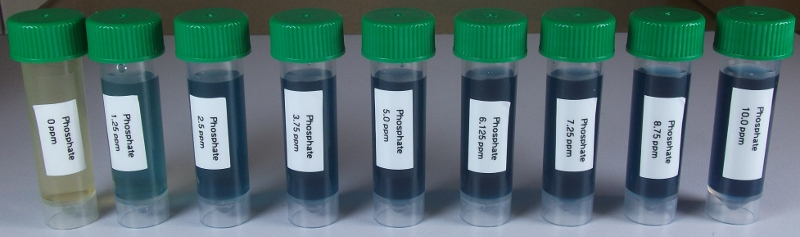

API phosphate test kit
========================

Reagents & Equipment
----------------------------

* Assembled colorimeter
* 5 mL sample bottles or other capped tubes
* API phosphate test kit
* Timer
* Cuvettes

Colorimeter set-up
------------------------

* Wavelength: 625 nm. Use Red led (colorimeter RGB board). 
* Phosphate standard data: download a data file or prepare your own phosphate standard data
* Before measuring blank the colorimeter against water or a distilled water sample developed with API reagent as described below

Method
---------
IMPORTANT: This is a time-sensitive assay. Before starting make sure you read through the instructions below. 
You will need to use a timer to measure your sample 5-10 mins after adding Bottle # 2. After approximately 10 mins the solution becomes cloudy and you will not get an accurate reading.

* Fill an empty sample bottle to the 5 mL line with your water sample.
* Add 6 drops of Bottle # 1 to the sample, cap and invert several times to mix
* Add 6 drops of Bottle # 2 and start timer. 
* Note the time since adding Bottle # 2. When it has been between 5-10 minutes, pour some of your sample into a cuvette, place in the colorimeter and click measure. The program will return the phosphate concentration in ppm. 