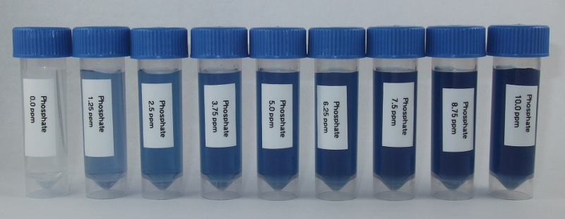

Ascorbic Acid Method
===========================

Ammonium molybdate and potassium antimonyl tartrate react in acid medium with orthophosphate to form a heteropoly acid - phosphomolybdic acid - that is reduced to intensely colored molybdenum blue by ascorbic acid. 
This method for measuring phosphate is based on APHA Standard Method 4500-P E

Reagents and Equipment
--------------------------
 
* Assembled colorimeter
* Cuvettes
* 5 mL screw capped tubes
* Sulfuric acid, (14% v/v), Labchem, Cat # LC256002
* Potassium antimonyl tartrate solution, Labchem, Cat # LC187201
* Ammonium molybdate solution (4%), Labchem, Cat # LC112101
* Ascorbic acid, Labchem, Cat # LC115309
* 1mL adjustable micropipette
* Distilled water. Optional, for diluting water sample

Colorimeter set-up
------------------------

* Wavelength: 625 nm. Use Red led (colorimeter RGB board). 
* Phosphate standard data: download a data file or prepare your own phosphate standard data
* Before measuring samples, calibrate the colorimeter against water or a distilled water sample developed with ascorbic acid reagent as described below

Method
--------

Step 1: Prepare fresh ascorbic acid reagent
^^^^^^^^^^^^^^^^^^^^^^^^^^^^^^^^^^^^^^^^^^^^^

* In a beaker dissolve 0.88 g of ascorbic acid in 50 mL distilled water;
* In a separate beaker add the reagents in the following order: 
   #. 25 mL sulfuric acid solution; 
   #. 2.5 mL potassium antimonyl tartrate solution; 
   #. 7.5 mL ammonium molybdate solution; 
   #. 15 mL ascorbic acid solution (prepared in step 1);
* Mix the ascorbic acid reagent. The reagent is stable for 4 hours.

Step 2: Sample testing
^^^^^^^^^^^^^^^^^^^^^^^^^^^^^^^^^^^^^^^^^^^

* Fill an empty sample bottle to the 5 mL line with your water sample
* Add 800 µL of test reagent solution, cap and invert several times to mix
* Note the time since adding the reagent to your water sample. When it has been at least 5-10 minutes, pour some of your sample into a cuvette, place in the colorimeter and click measure.The program will return the phosphate concentration in ppm.

