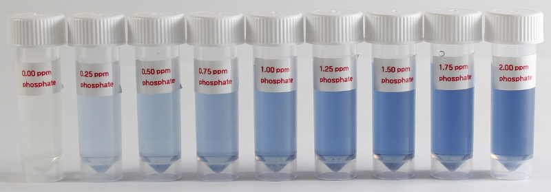

Hach PhosVer3 Reagent
===========================

For determination of reactive (ortho) phosphate (phosphorus) by the PhosVer® 3 ascorbic acid method. Phosphate results in a blue color which is measured with the colorimeter and an 880nm (IR) led. 
Recommend using a stir-plate for best results.

Reagents & Equipment
----------------------------

* Colorimeter with 880 nm LED (e.g. LED Ver B board)
* Cuvettes
* Stir plate with stir bar
* Small beaker
* 1 mL pipette
* PhosVer3 Hach Part # 21060-69 for 10 mL samples, pack of 100. $31.29. Hach Method 8048 (Ascorbic acid method).
* Distilled water. Optional, for diluting water samples.

Colorimeter set-up
------------------------

* Wavelength: 880nm. Use a custom LED board with 880 nm LED 
* Phosphate standard data: download a data file or prepare your own
* Before measuring blank the colorimeter against water or a distilled water sample developed with PhosVer3 reagent as described below

Method
---------

* Transfer 10 mL of water sample into a small beaker with stir bar. 
* Add the contents of a packet of PhosVer3 to the beaker. Start mixing fairly vigorously.
* You should see a blue color develop between 15-30 seconds.
* After 3 minutes, take the beaker off the stir plate and transfer some to a cuvette for measurement. 

