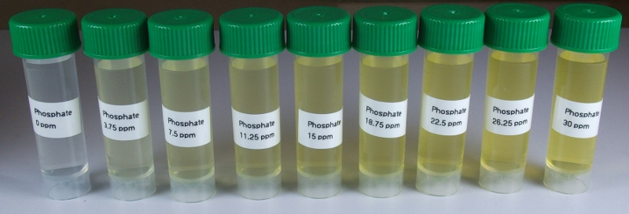

Vanadate-molybdate method
==============================

This method is based on APHA Standard Method 4500-P C. Description of the assay from the method: In a dilute orthophosphate solution, ammonium molybdate reacts under acid conditions to form a heteropoly acid, molybdophosphoric acid. In the presence of vanadium, yellow vanadomolybdophosphoric acid is formed. 
The intensity of the yellow color is proportional to phosphate concentration. 

Reagents & Equipment
----------------------------

* Colorimeter
* Cuvettes
* Vanadate-molybdate reagent, Labchem Cat # LC266002
* 1 mL variable micropipette

Colorimeter set-up
------------------------

* Wavelength: 470 nm. Use BLUE led (colorimeter RGB board). 
* Phosphate standard data: download a data file or prepare your own phosphate standard data
* Before measuring samples, calibrate the colorimeter against water or a distilled water sample developed with vanadate-molybdate reagent as described below

Method
---------

* Transfer 1 mL of sample water into a clean cuvette.
* Add 0.25 mL of vanadate-molybdate reagent and mix by pipetting up and down several times.
* Wait at least 10 minutes for color to develop.
* Place the cuvette with your sample into the colorimeter and click measure. The program will return the phosphate concentration in ppm.

